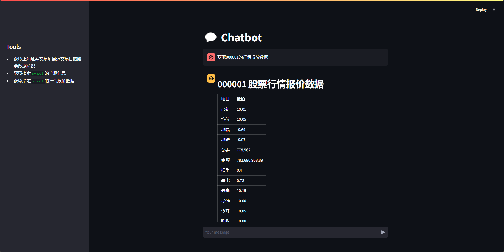

# akshare-gpt

`akshare-gpt` 是一个开源工具，旨在将 [Akshare](https://akshare.readthedocs.io/) 集成到 GPT 的工具中，实现自然语言问答。通过这个工具，用户可以方便地获取金融数据、经济指标和其他相关信息。



## 特性

- **自然语言处理**：用户可以使用自然语言提出问题，系统将自动解析并返回相应的数据。
- **金融数据访问**：直接从 Akshare 获取股票、期货、外汇等多种金融数据。
- **简化接口**：封装了 Akshare 的复杂调用，使得数据获取更加简单直观。

## 安装

```bash
cp config-template.toml config.toml
pip install -r requirements.txt
```

## 运行

```bash
streamlit run main.py
```

## 使用方法

### 定义 tool

```python
from typing import Annotated

import akshare as ak

from modules.tools.tool_register import register_tool


@register_tool
def get_stock_sse_summary() -> str:
    """
    获取上海证券交易所最近交易日的股票数据总貌
    """
    df = ak.stock_sse_summary()
    return df.to_json(orient="records", force_ascii=False)
```

*参考./modules/tools/akshare/stock.py*

### 调用 openai
```python
from datetime import datetime

from modules.config import load_config
from modules.openai_assistant import OpenAIAssistant

openai_config = load_config()["openai"]
assistant = OpenAIAssistant(
    openai_config["api_key"], openai_config["base_url"], openai_config["model"]
)

messages = [
    {
        "role": "system",
        "content": "你是一个智能助手，今天日期是{}".format(
            datetime.now().strftime("%Y-%m-%d")
        ),
    },
    {
        "role": "user",
        "content": "获取000001的行情报价数据",
    },
]
print(assistant.run_conversation(messages))
```